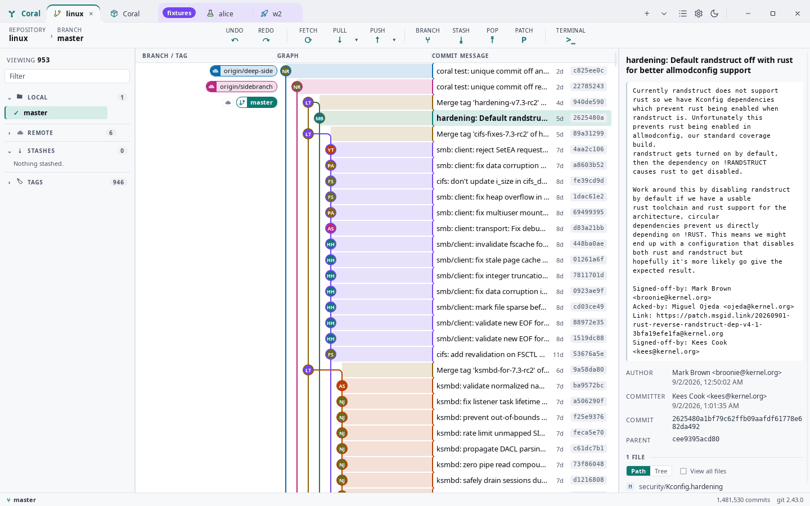
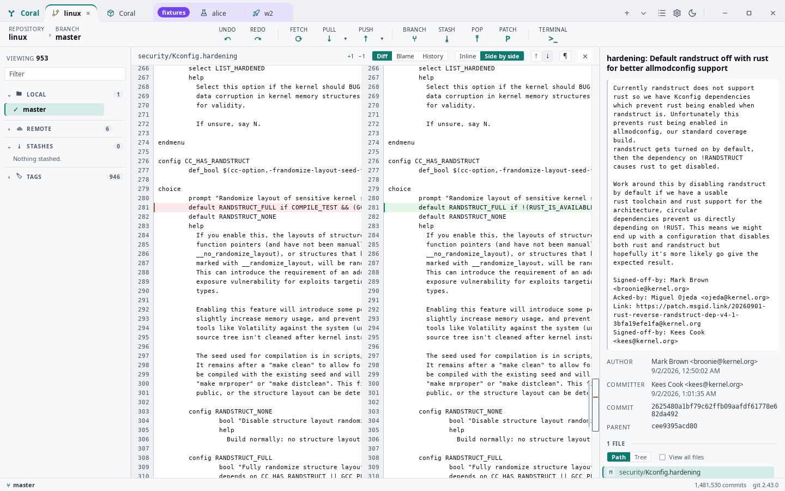
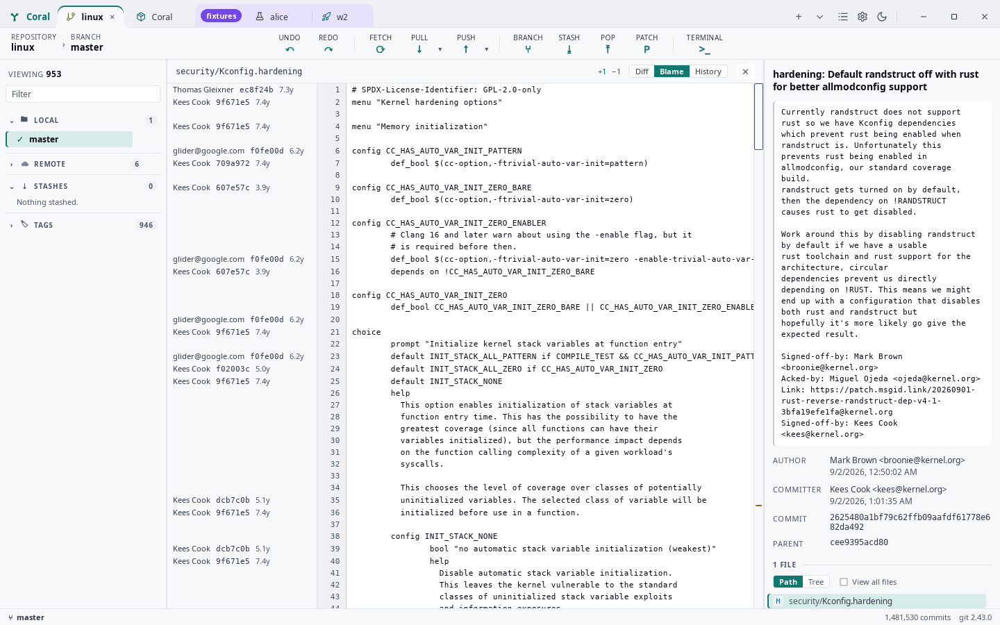
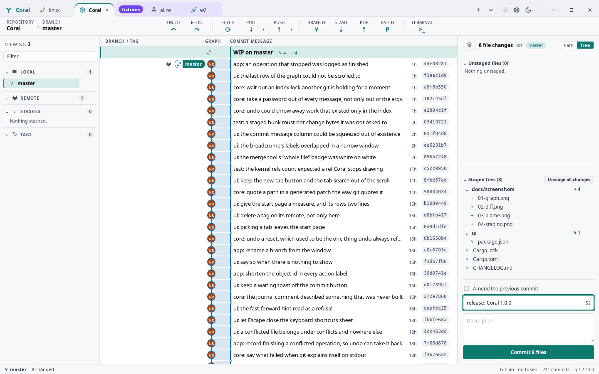
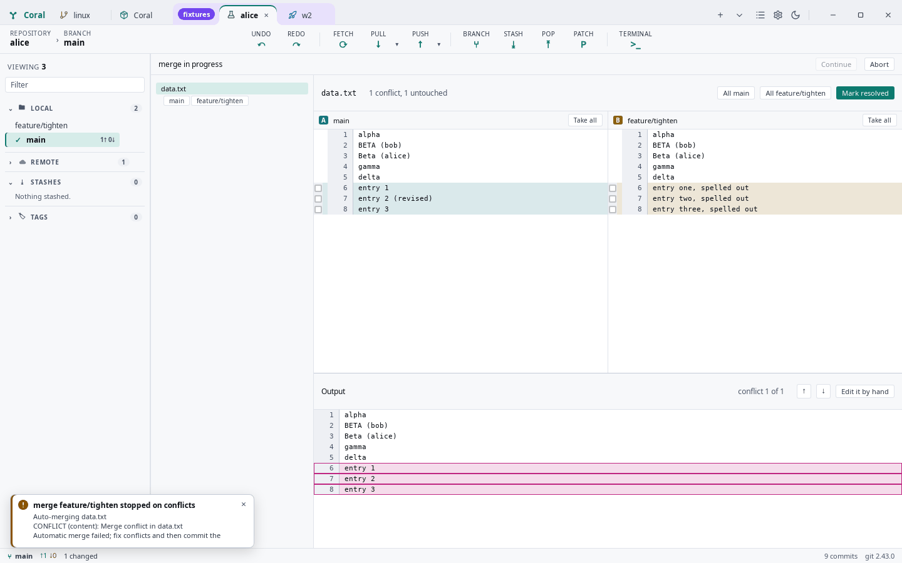
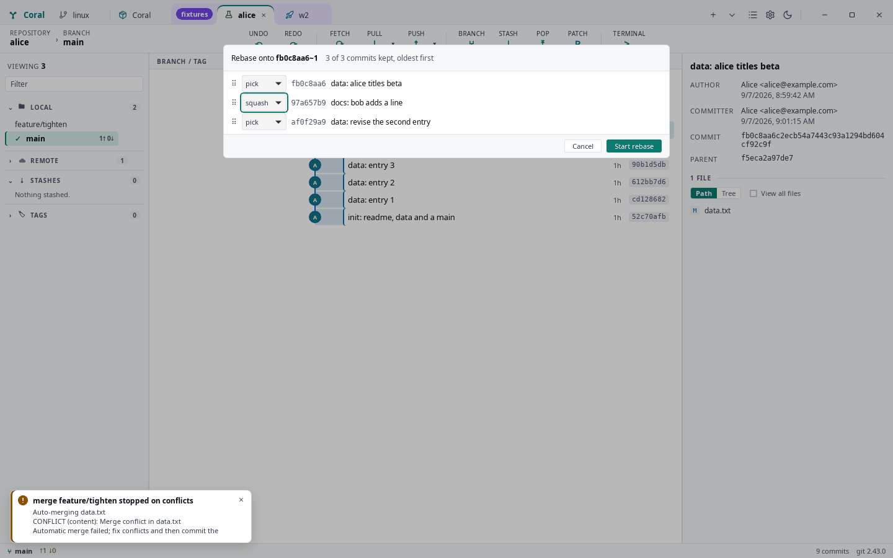
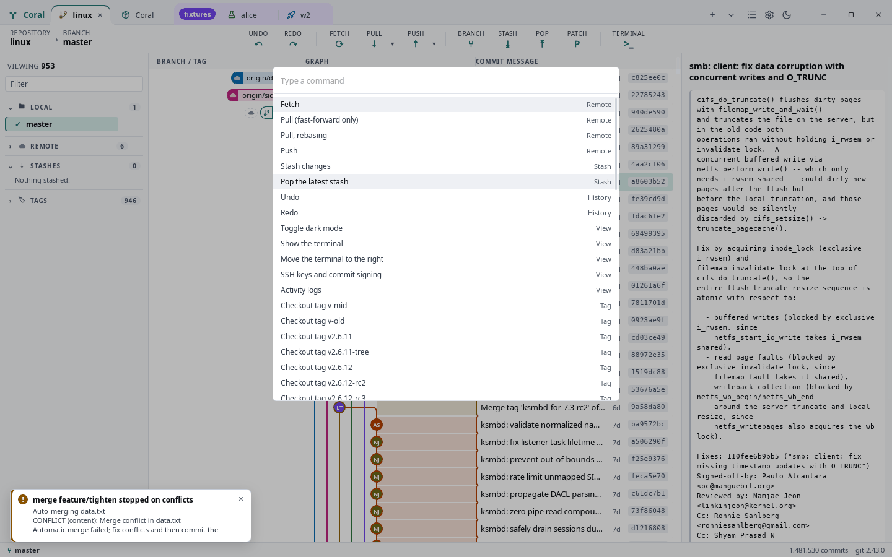
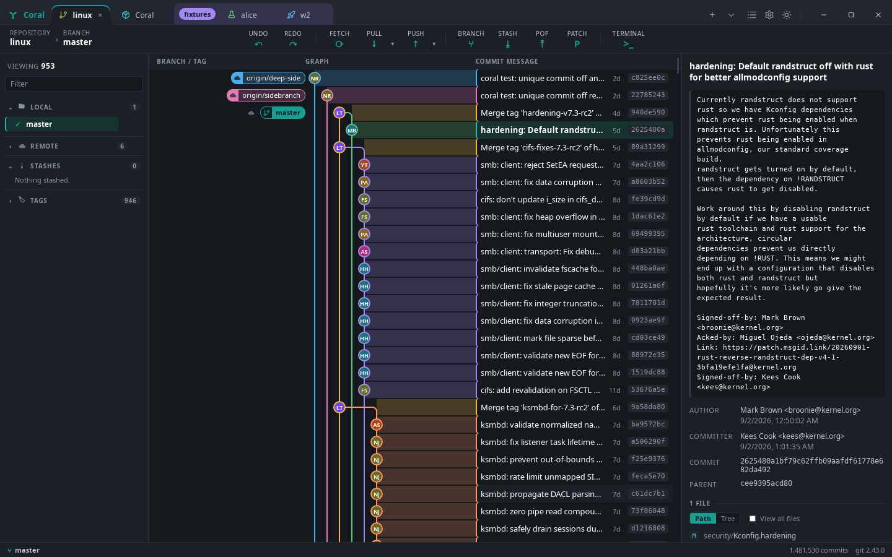
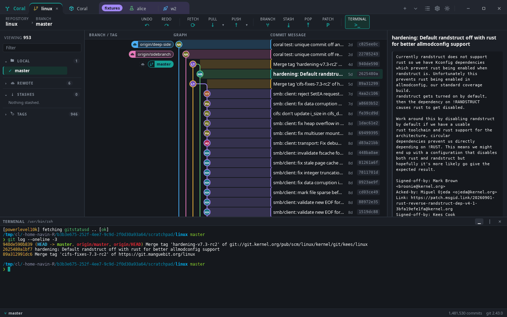
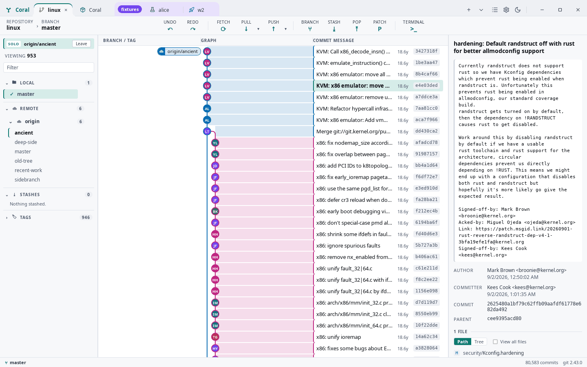

# Coral

A desktop Git client that stays quick on a repository nobody else is quick on. Rust engine,
Tauri 2 shell, Svelte 5 interface, and a command-line front end over the same engine, so
everything the window does can be driven and tested without one.

The interface is modelled on GitKraken: someone who uses that daily should be able to sit down
at Coral and work without reading anything. The layout, density and interactions follow it
deliberately. None of its assets, icons or code are used — the icons are Lucide, the faces are
Inter and JetBrains Mono, and everything under the window is this project's own.

The measure is the Linux kernel: 1.48M commits and a 96k-file worktree. It opens to a painted
graph in well under a second, walks the whole history in about five, and scrolls at 60 fps.
Those are budgets rather than boasts — `docs/ARCHITECTURE.md` lists them, and the benchmarks
run against a real clone.

## What it looks like

Every screenshot below is the Linux kernel unless it says otherwise: 1,481,530 commits, 946
tags, six branches.



*The graph. Lanes on a canvas, rows as text beside them, a million commits costing a window's
worth of DOM. The panel on the right is the commit under the cursor.*

| | |
|---|---|
| [](docs/screenshots/02-diff.png) | [](docs/screenshots/03-blame.png) |
| **Diffs** read inline or side by side, with word-level highlighting, and step change by change in either layout. | **Blame** attributes every line to the commit that last changed it, with the age beside it. |
| [](docs/screenshots/04-staging.png) | [](docs/screenshots/05-conflicts.png) |
| **Staging** by file, by hunk or by line, as a tree or a flat list. This is Coral's own repository, staging this release. | **Conflicts** in three panes built from the index stages, with the sides named after the refs involved rather than "ours" and "theirs". |
| [](docs/screenshots/06-rebase.png) | [](docs/screenshots/07-palette.png) |
| **Interactive rebase** with a picker for reword, squash, fixup, edit, drop and reorder, before anything runs. | **The command palette** on `Ctrl+P`, with every action and every tag in the repository. |
| [](docs/screenshots/08-dark.png) | [](docs/screenshots/09-terminal.png) |
| **A dark theme**, chosen or followed from the desktop. | **A terminal** in the repository, on ``Ctrl+` ``. |



*Solo. The same repository with one branch walked and the other 952 refs left out — the banner
names it and gives it back. Hiding does the reverse, and either choice is remembered for that
repository.*

## What it does

**The graph.** Every ref, with lanes drawn on a canvas and the rows as text beside them, so a
million commits cost a window's worth of DOM and nothing more. Branch and tag labels sit on the
commit they name. A branch can be **soloed** to walk only its history, or **hidden** to take it
out of the walk, and either choice is remembered for that repository.

**The panel.** Local branches, remotes with their branches nested, pull and merge requests,
tags newest first, stashes, and submodules. Anything can be filtered, and every branch and tag
carries an eye that takes it out of the graph.

**Working with changes.** Stage and unstage by file, by hunk or by line; commit, amend, discard.
The file panel answers four questions about one file: what changed, who wrote each line, what
has touched it, and the same again with whitespace discounted. Diffs read inline or side by
side, with word-level highlighting.

**Patches.** Two commits picked in the graph are written out as a numbered series with one
button; the same button takes patch files back in, either as commits with their original
authors or as changes left in the working copy to read first. A patch that no longer applies
cleanly stops in the conflict tool rather than failing.

**Rewriting history.** Merge, rebase, interactive rebase with a picker for reword, squash,
fixup, edit, drop and reorder, cherry-pick, revert, and reset. Every one of them is journalled,
so **undo** reverses an operation it knows nothing about by restoring the refs it moved — and it
syncs the worktree, so undoing does not leave the index describing a commit that is no longer
there.

**Conflicts.** A three-pane tool built from the index stages rather than parsed out of the
worktree file, so what you see does not depend on your `merge.conflictStyle`. The sides are
named after the refs involved, never "ours" and "theirs", because during a rebase those words
are backwards and the tool says so.

**Remotes and hosting.** Fetch, pull, push, prune, and per-ref rejection reporting. Forcing is
always `--force-with-lease`. Coral is its own git credential helper, so a token never appears in
a URL, a config file or an argument list. GitHub and GitLab, including Enterprise and
self-hosted, list their pull and merge requests beside the branches.

**Around the edges.** Repository tabs with Chrome-style groups, an embedded terminal, commit
signing configured per repository, SSH key selection, worktrees, patches, a command palette,
rebindable shortcuts, and light and dark themes.

## Two front ends, one engine

`coral-cli` is not a demo. It exposes the whole engine — fifty-two commands, from `open` and
`status` through `rebase`, `conflict-resolve`, `blame` and `graph` — and answers in a stable
JSON envelope with documented exit codes:

```
coral --repo /path/to/repo graph --json --solo refs/heads/main | jq .result.total
coral --repo /path/to/repo status --json
```

That is what makes the kernel scenarios testable without a GUI, and it is why the window and the
CLI cannot disagree about what an operation did.

## Layout

| Path | What it is |
|---|---|
| `crates/coral-core` | The engine. Everything git. No UI, no HTTP, no Tauri. |
| `crates/coral-hosting` | GitHub and GitLab. Never on the graph's critical path. |
| `crates/coral-cli` | Binary `coral`. The headless test surface. |
| `crates/coral-app` | Tauri backend. Thin wrappers over the engine. |
| `ui/` | Svelte 5 + Vite interface. Renders; never decides. |

## Getting started

```
sudo apt install libwebkit2gtk-4.1-dev libxdo-dev libayatana-appindicator3-dev librsvg2-dev
cargo install just cargo-about cargo-deny
cargo install tauri-cli --version "^2" --locked

just check     # fmt, clippy, tests, svelte-check, ui build
just dev       # run the app
just cli open  # run the CLI against the current directory
```

`just kernel-clone` fetches the Linux kernel into `~/.cache/coral-bench/linux` for the
benchmarks; `just kernel-test` runs the scenarios against it.

Those four lines are Linux. `docs/build/os.md` has the whole of it for Linux, macOS and
Windows, including the bundles and what to do when a build fails.

See `CHANGELOG.md` for what changed, `CLAUDE.md` for the working rules,
`docs/ARCHITECTURE.md` for the design, and `docs/DECISIONS.md` for why things are the way they
are.

## License

MIT. See `CREDITS.md` for the projects Coral builds on.
